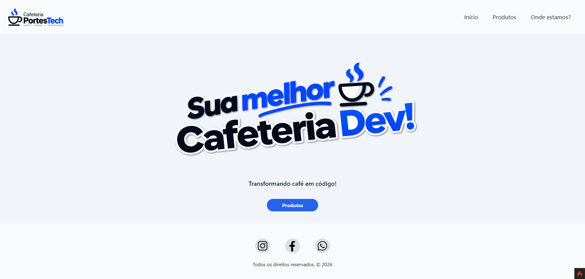

# Cafeteria PortesTech

Site de uma cafeteria com tema de tecnologia, feito como projeto de estudo com PHP e CodeIgniter 4.



## Sobre o projeto

O site tem três páginas principais:

- página inicial;
- lista de produtos;
- localização e contato.

## Tecnologias

- PHP 8.4+
- CodeIgniter 4
- Bootstrap 5

## Instalação

Clone o repositório e instale as dependências:

```bash
git clone https://github.com/seu-usuario/cafeteria-portestech.git
cd cafeteria-portestech
composer install
```

Copie o arquivo de ambiente:

```bash
copy env .env
```

No Linux ou macOS, use `cp env .env`.

Se precisar, ajuste as configurações no arquivo `.env`.

## Execução

Inicie o servidor local:

```bash
php spark serve
```

Depois, acesse `http://localhost:8080` no navegador.

## Rotas

- `/` - página inicial
- `/products` - produtos
- `/location` - localização e contato

## Estrutura

As páginas ficam em `app/Views` e os arquivos públicos, como CSS e imagens, em `public/assets`.

## Licença

MIT
